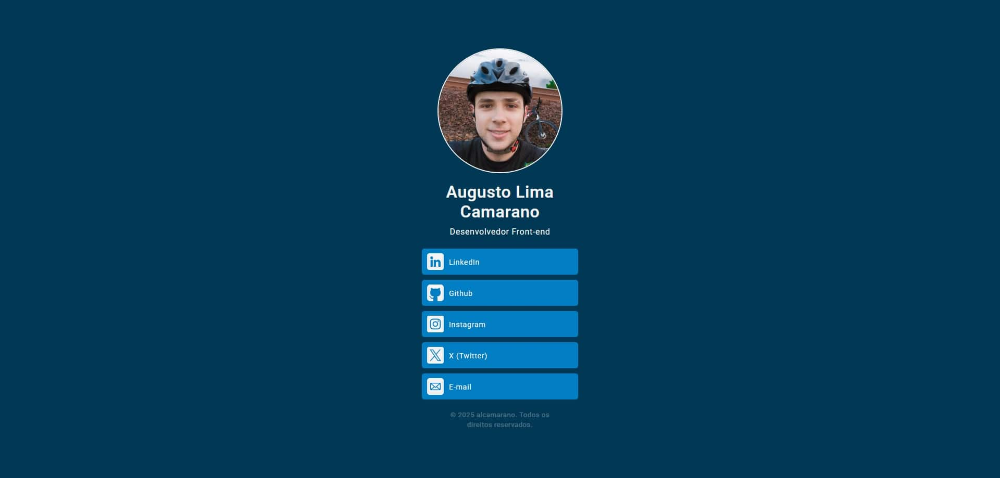

# Bio Link's

O Bio Link's é um projeto simples, criado para reunir em um só lugar as formas de contato e as principais informações sobre o meu trabalho.

A página funciona como uma central de links com visual limpo e objetivo, pensada para facilitar o acesso às redes sociais e meios de comunicação de forma rápida e intuitiva.

A proposta foi desenvolver algo leve, funcional e que servisse como alternativa às ferramentas prontas de "link na bio", oferecendo liberdade total de personalização. É ideal para quem busca controle sobre o próprio estilo e apresentação online, sem depender de plataformas externas.

## 🔧 Tecnologias e ferramentas utilizadas

## 📸 Prévia do projeto

Abaixo está uma visualização da página em funcionamento, mostrando como o Bio Link's organiza de forma simples e direta os principais links e informações: 

## 🌐 Acessando a página

O Bio Link's já está disponível online. Você pode visualizar a página [clicando aqui](URL).

## 👤 Autor

<table>
    <tr>
        <td align="center">
            <a href="https://github.com/alcamarano" title="Acesse o meu Github">
             
            
                <b>Augusto Lima Camarano</b>
            
            </a>
        </td>
    </tr>
<table>    

## 📄 Licença

Este projeto está sob a licença MIT e pode ser conferida [clicando aqui](https://github.com/alcamarano/bio-links/blob/main/LICENSE).
