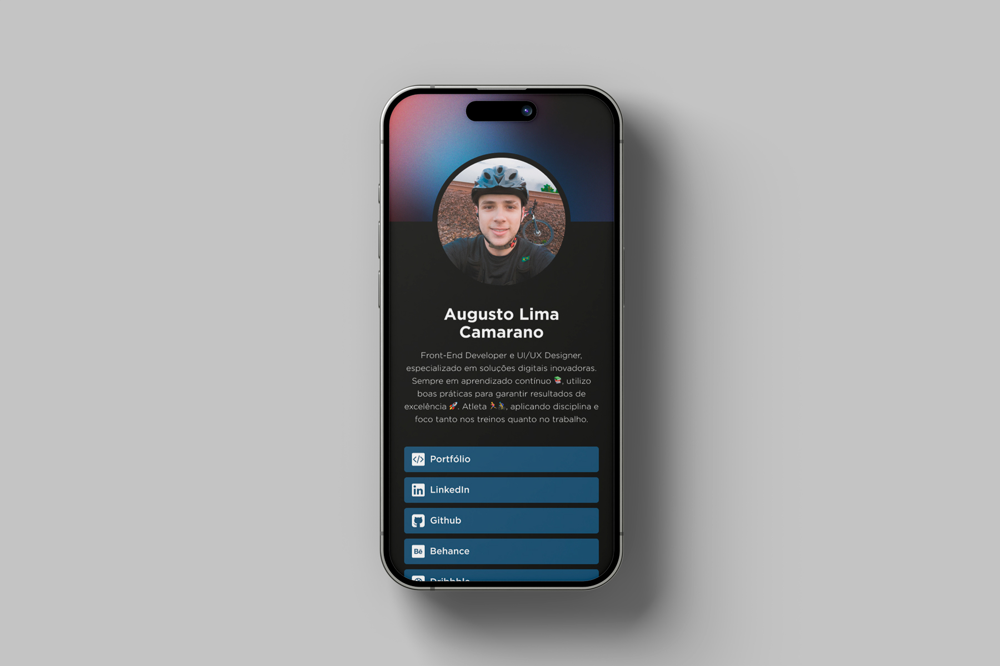

<h1 align="center">Bio Link</h1>

 <a href="#sobre">Sobre</a> •
 <a href="#funcionalidades">Funcionalidades</a> •
 <a href="#layout">Layout</a> • 
 <a href="#tecnologias">Tecnologias e Softwares</a> • 
 <a href="#autor">Autor</a> • 
 <a href="#licenca">Licença</a>

<h3 align="center">Para acessar o projeto, <a href="https://alcamarano.github.io/bio-links/" target="_blank" title="Bio Link">clique aqui</a>.</h3>

<h2 id="sobre">💻 Sobre o projeto</h2>

  O Bio Link's é um projeto que desenvolvi para centralizar e organizar todos os meus links importantes em um único lugar, facilitando o acesso às minhas redes sociais, portfólio, conteúdos e muito mais. Com uma interface intuitiva e personalizável, o Bio Link permite que eu compartilhe uma página prática e moderna, especialmente criada para meus seguidores e contatos.

  A ideia do projeto é reunir todas as minhas informações em uma única página otimizada, garantindo que minha audiência encontre rapidamente o que procura, seja para acessar minhas redes sociais, blog, site pessoal ou outras plataformas. Ideal para criadores de conteúdo, empreendedores, freelancers, ou para quem, como eu, precisa facilitar a navegação e o acesso aos seus links de forma rápida e organizada.

  <strong>Principais características:</strong>

<ul>
  <li><strong>Organização e centralização:</strong> todos os meus links em uma página simples e bem organizada;</li>
  <li><strong>Design Personalizado:</strong> permite personalizar a aparência para refletir meu estilo ou marca pessoal;</li>
  <li><strong>Acesso rápido e prático:</strong> um link único e fácil de compartilhar em todas as plataformas.</li>
</ul>

  Com o Bio Link's, deixo o acesso ao meu conteúdo mais eficiente e acessível, criando uma experiência simplificada para quem deseja se conectar comigo.

<h2 id="funcionalidades">⚙️ Funcionalidades</h2>

  O Bio Link's é minha página pessoal de links, pensada para centralizar e organizar o acesso a todas as minhas plataformas e conteúdos de forma prática e personalizada. Confira as principais funcionalidades:

<ul>
  <li>Permite adicionar, organizar e editar meus links com facilidade, garantindo que as informações mais importantes estejam sempre à mão para quem visita minha página;</li>
  <li>Possibilita personalizar a aparência da página para refletir meu estilo, com escolhas de cores, fontes e ícones que deixam a página com a minha cara;</li>
  <li>Facilita a inclusão de botões de acesso direto às minhas redes sociais, permitindo que seguidores ou contatos encontrem minhas principais plataformas;</li>
  <li>Possibilita adicionar imagens ou vídeos para enriquecer a página e torná-la mais interessante e visualmente dinâmica.</li>
</ul>

  Essas funcionalidades fazem do Bio Link's uma ferramenta pessoal e prática, que me ajuda a organizar e compartilhar todos os meus links em um só lugar, facilitando o acesso para quem deseja acompanhar meu conteúdo e se conectar comigo.

<h2 id="layout">🎨 Layout</h2>

<h2 id="tecnologias">🛠 Tecnologias e Softwares</h2>

  O Bio Link's foi desenvolvido com tecnologias modernas e amplamente utilizadas na criação de interfaces web. Abaixo estão as principais ferramentas e linguagens aplicadas para tornar este projeto funcional e visualmente atraente:

<ul>
  <li><strong>HTML5:</strong> utilizado para estruturar e organizar o conteúdo da página de forma semântica e acessível, garantindo uma base sólida e bem organizada para todos os elementos.</li>
  <li><strong>CSS3:</strong> aplicado para estilizar e personalizar a página, criando um design responsivo e ajustável. Através do CSS3, pude incorporar cores, fontes, ícones e animações que tornam a experiência visual mais atrativa.</li>
  <li><strong>Visual Studio Code:</strong> utilizado como o editor de código principal, proporcionando um ambiente eficiente e produtivo para o desenvolvimento do projeto.</li>
  <li><strong>Figma:</strong> utilizado para criar os protótipos e layouts visuais da página, garantindo que o design fosse bem estruturado e esteticamente agradável antes da implementação.</li>
</ul>

<h2 id="autor">🦸 Autor</h2>
<table>
 <tr>
  <td align="center">
   <a href="https://github.com/alcamarano">
     <b>Augusto Lima Camarano</b>
   </a>
  </td>
 </tr>
</table>

<h2 id="licenca">📝 Licença</h2>

  Este projeto esta sobe a licença <a href="./LICENSE">MIT</a>.

  Feito com ❤️ por Augusto Lima Camarano.

